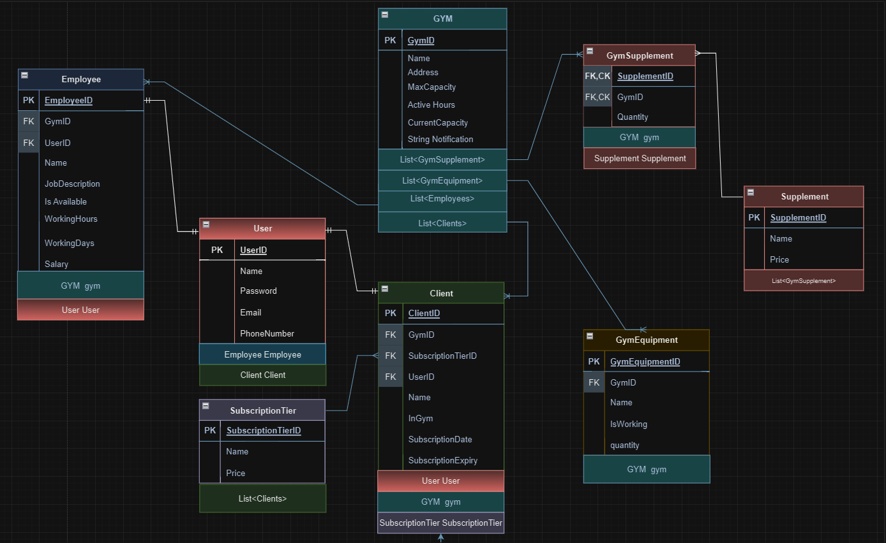

# Gym Management System: Enhanced Gym Operations and Client Experience 🏢🖥️
Welcome to our Gym Management System, a sophisticated solution meticulously crafted to optimize gym operations, empower staff members, and provide clients with an exceptional gym experience.

## Key Features 🔑

- **Effortless Gym Operations:** Equips gym managers with a comprehensive suite of tools to streamline administrative tasks, ensuring smooth member management and resource allocation.

- **Employee Empowerment:** Empowers gym employees through a centralized platform that offers real-time updates on gym activities, schedules, and resources, facilitating efficient coordination and service delivery.

- **Client-Centric Transparency:** Elevates client experience by providing full transparency into gym operations. Clients can easily access vital information such as gym hours, real-time capacity, equipment availability, supplement offerings, and subscription tiers.

- **Streamlined Interaction:** Simplifies client interactions with the gym using a user-friendly interface. Clients can seamlessly navigate the application, making inquiries, adjusting subscription tiers, and managing preferences effortlessly.

- **Continuous Updates:** Stay informed and up-to-date with automatic updates that ensure everyone is aligned with the latest gym news, announcements, and operational changes.

Our Gym Management System harmoniously blends operational efficiency, employee empowerment, and client satisfaction to create a modern gym environment where management is seamless, communication is transparent, and experiences are enriched.

---

## ERD: 📊

