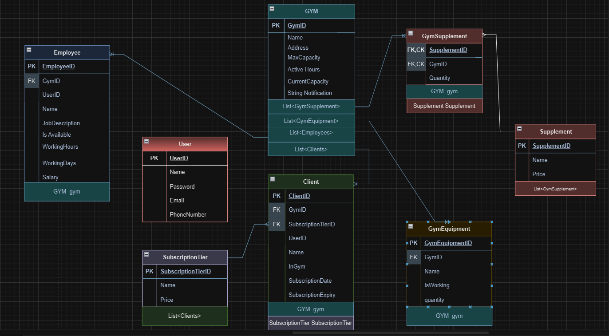

# Gym Management System: Enhanced Gym Operations and Client Experience 🏢🖥️
Welcome to our Gym Management System, a sophisticated solution meticulously crafted to optimize gym operations, empower staff members, and provide clients with an exceptional gym experience.

---
## Description
The GYM Management System API is designed to streamline gym management tasks, allowing administrators, employees, and clients to perform various actions related to gym operations. It includes features such as client management, employee management, gym equipment tracking, subscription tiers, and user authentication.

---

## Key Features 🔑

- **Effortless Gym Operations:** Equips gym managers with a comprehensive suite of tools to streamline administrative tasks, ensuring smooth member management and resource allocation.

- **Employee Empowerment:** Empowers gym employees through a centralized platform that offers real-time updates on gym activities, schedules, and resources, facilitating efficient coordination and service delivery.

- **Client-Centric Transparency:** Elevates client experience by providing full transparency into gym operations. Clients can easily access vital information such as gym hours, real-time capacity, equipment availability, supplement offerings, and subscription tiers.

- **Streamlined Interaction:** Simplifies client interactions with the gym using a user-friendly interface. Clients can seamlessly navigate the application, making inquiries, adjusting subscription tiers, and managing preferences effortlessly.

- **Continuous Updates:** Stay informed and up-to-date with automatic updates that ensure everyone is aligned with the latest gym news, announcements, and operational changes.
- **Gym Equipment Tracking:** Track gym equipment by creating, updating, and deleting equipment details. Users can also retrieve information about individual equipment..
- **Subscription Tiers::** Manage different subscription tiers offered by the gym. Administrators can create, update, and delete subscription tiers, and users can view available subscription options..

Our Gym Management System harmoniously blends operational efficiency, employee empowerment, and client satisfaction to create a modern gym environment where management is seamless, communication is transparent, and experiences are enriched.

---

## Usage
To use the GYM Management System API, you can send HTTP requests to the provided endpoints using tools like Postman or integrate it into your own application. The API endpoints are designed to handle different aspects of gym management, including clients, employees, gym equipment, subscriptions, and user registration/authentication.

---
## ERD: 📊

---
## Endpoints
### Clients
- GET /api/Clients/{gymid}: Get a list of clients for a specific gym.
- GET /api/client/{clientid}/gym/{gymid}: Get details of a specific client in a gym.
- PUT /api/Clients/{gymid}/{clientid}: Update client information.
- POST /api/Clients/{gymid}: Create a new client.
- DELETE /api/Gym/{gymid}/Client/{clientid}: Delete a client from a gym.
### Employees
- GET /api/Employees: Get a list of employees.
- GET /api/Employees/{id}: Get details of a specific employee.
- PUT /api/Employees/{id}: Update employee information.
- POST /api/Employees: Create a new employee.
- DELETE /api/Employees/{id}: Delete an employee.
- GET /api/Employees/Gym/{gymId}: Get a list of employees in a specific gym.
### Gym Equipment
- GET /api/GymEquipments: Get a list of gym equipment.
- GET /api/GymEquipments/{id}: Get details of a specific gym equipment.
- PUT /api/GymEquipments/{id}: Update gym equipment information.
- POST /api/GymEquipments: Create new gym equipment.
- DELETE /api/GymEquipments/{id}: Delete gym equipment.
### Gyms
- GET /api/Gyms/Manager: Get a list of gyms managed by users.
- GET /api/Gyms: Get a list of all gyms.
- GET /api/Gyms/{id}: Get details of a specific gym.
- PUT /api/Gyms/{id}: Update gym information.
- POST /api/Gyms: Create a new gym.
- DELETE /api/Gyms/{id}: Delete a gym.
- POST /api/Gyms/{gymId}/Supplement/{SupplementId}: Add supplements to a gym.
- PUT /api/Gyms/{gymId}/Supplement/{supplementId}: Update supplement details for a gym.
- DELETE /api/Gyms/{gymId}/Supplement/{supplementId}: Remove supplements from a gym.
### Subscription Tiers
- GET /api/SubscriptionTiers: Get a list of subscription tiers.
- GET /api/SubscriptionTiers/{id}: Get details of a specific subscription tier.
- PUT /api/SubscriptionTiers/{id}: Update subscription tier information.
- POST /api/SubscriptionTiers: Create a new subscription tier.
- DELETE /api/SubscriptionTiers/{id}: Delete a subscription tier.
### Supplements
- GET /api/Supplements: Get a list of supplements.
- GET /api/Supplements/{id}: Get details of a specific supplement.
- PUT /api/Supplements/{id}: Update supplement information.
- POST /api/Supplements: Create a new supplement.
- DELETE /api/Supplements/{id}: Delete a supplement.
### User
- POST /api/User/Login: User login endpoint.
- POST /api/User/AdminRegister: Register a new admin user.
- POST /api/User/EmployeeRegister: Register a new employee user.
- POST /api/User/ClientRegister: Register a new client user.

----
## Conclusion
The GYM Management System API provides a powerful set of tools to manage various aspects of gym operations, from client management to equipment tracking and user authentication. By utilizing this API, you can enhance the efficiency of your gym management processes.

